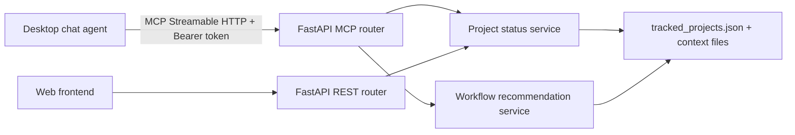

# Research: FastAPI MCP Server for 10xDevTracker

**Date**: 2026-07-27T09:54:27+02:00
**Researcher**: GitHub Copilot
**Git Commit**: 3b014b2c4a85fec39d51bc4c26cb80ce96730b7d
**Branch**: master
**Repository**: 10xtracker

## Research Question

Can 10xDevTracker expose a desktop chat-agent-facing MCP server, implemented with FastAPI only (without FastMCP), that reports current project status, recent work, and the next recommended 10x workflow action, protected by a manually generated environment secret?

## Summary

Yes. The application already has a small, read-oriented domain layer that aggregates tracked projects, changes, phase progress, and roadmap outcomes. FastAPI should remain the application host, while the official Python MCP SDK handles MCP Streamable HTTP and protocol/session behavior. FastMCP is not required.

The first release should expose read-only tools only:

1. `get_project_status` returns the existing tracked-project aggregate.
2. `get_recent_work` sorts change records by their `updated` frontmatter value and clearly labels this as file-update activity, not an audit trail.
3. `get_next_10x_action` derives a recommendation from `change.md`, optional research/frame/plan/review artifacts, plan progress checkboxes, and the roadmap ordering.

The implementation must not create a custom REST tool-invocation format: chat agents require the MCP protocol. It should use a single `POST /mcp` Streamable HTTP endpoint, standard `Authorization: Bearer <secret>` authentication, a constant-time comparison, and a fail-closed configuration. Run Uvicorn explicitly on `127.0.0.1`; the token remains required because any local process can otherwise call the endpoint.

## Detailed Findings

### Existing Status Aggregate

- `GET /api/projects` reads every tracked project and serializes it through `_to_project_response`; this is the closest existing application-level reuse boundary ([app/api.py](app/api.py#L28-L48)).
- `ChangeSummary` already includes workflow state, a last-updated value, parse errors, phase progress, and roadmap correlation ([app/changes.py](app/changes.py#L10-L17)). `list_changes` enriches each active change with the two latter values and remains read-only ([app/changes.py](app/changes.py#L58-L75)).
- Invalid YAML and missing required fields are represented as an `error` on the summary rather than aborting the project response ([app/changes.py](app/changes.py#L36-L56)). MCP results should preserve those errors as data.
- The tracked-project source of truth is `data/tracked_projects.json`; `load_tracked_projects` is the safe read-only entry point ([app/projects.py](app/projects.py#L11-L14)). Project paths are valid only when they contain `context/changes` ([app/projects.py](app/projects.py#L7-L9)).

**Recommendation:** extract a public `get_project_statuses()` service from the current API-private `_to_project_response` and have both REST and MCP adapters call it. Do not make the MCP router import an underscore-prefixed REST helper.

### Recent Work Has a Defined, Limited Signal

- A change's available activity value is its frontmatter `updated` field; it is required during parsing ([app/changes.py](app/changes.py#L7-L8), [app/changes.py](app/changes.py#L47-L56)).
- The current parser does not retain `created`, timestamps for individual progress items, Git history, or actor information. The phase parser only counts checked and unchecked rows ([app/plan_progress.py](app/plan_progress.py#L35-L67)).

**Recommendation:** define `get_recent_work(limit=10, project_path=None)` as changes sorted by valid ISO `updated` dates, returning project, change ID, title, status, phase summary, and roadmap outcome. Results with invalid/missing dates should appear after dated results and retain their parse error. Describe the result as "recently updated change records", never as a chronological activity log.

### A Next-Action Tool Needs New Workflow Logic

The current application reports state but has no code that decides which 10x skill should run next. The 10x workflow uses these authoritative artifacts:

- `change.md` establishes lifecycle state (`new`, planning/review/execution states, and archived) and is currently only parsed for four summary fields ([app/changes.py](app/changes.py#L5-L8), [app/changes.py](app/changes.py#L36-L56)).
- `plan.md` has a `## Progress` section; the first incomplete phase is computed today, while fully complete plans return their last phase ([app/plan_progress.py](app/plan_progress.py#L42-L67)).
- `roadmap.md` supplies the change-to-outcome relation, parsed from its `## At a glance` table ([app/roadmap_correlation.py](app/roadmap_correlation.py#L9-L42)). It does not currently expose prerequisite or roadmap-status columns.

**Recommendation:** add a separate `workflow_recommendations.py` domain module rather than overload `plan_progress.py`. It should return structured recommendations with `project_path`, `change_id`, `command`, `reason`, `confidence`, and `blocking_question` when the workflow cannot safely choose.

Initial deterministic rules:

| Observed state | Recommendation |
| --- | --- |
| No active change and a pending roadmap slice exists | Select the earliest eligible roadmap slice and run `/10x-new <change-id>`; report unmet prerequisites rather than guessing. |
| `new` with no `research.md` or `frame.md` | Recommend `/10x-research <change-id>` when codebase context is needed; frame is optional for ambiguous problem statements. |
| `new` or `preparing` with research/frame complete and no `plan.md` | Recommend `/10x-plan <change-id>`. |
| `planned` with no plan review | Recommend `/10x-plan-review <change-id>` as the normal quality gate. |
| Reviewed plan or implementation with an unchecked automated row | Recommend `/10x-implement <change-id>` and name the first incomplete phase. Offer `/10x-tdd` only when the caller explicitly selects test-first execution. |
| All plan-progress rows checked | Recommend `/10x-impl-review <change-id>`, then `/10x-archive <change-id>`. |
| No trustworthy state or conflicting artifacts | Return no command and a blocking question. |

The execution-mode selection is intentionally not fully deterministic: `/10x-implement`, `/10x-tdd`, `/10x-e2e`, and `/10x-goal-implement` have different preconditions and human-control tradeoffs. The tool should recommend the conservative interactive default and list applicable alternatives, rather than assert one is objectively correct.

### MCP Transport and Desktop Authentication

- The dependency set contains FastAPI and Uvicorn but no MCP SDK or FastMCP ([pyproject.toml](pyproject.toml#L7-L17)). Add the official Python MCP SDK as the protocol dependency; do not hand-roll the protocol adapter and do not add FastMCP.
- FastAPI is currently created once and only mounts the REST router plus static frontend ([app/main.py](app/main.py#L1-L7)). This is the insertion point for a dedicated MCP router.
- The existing API tests instantiate the same application with `TestClient`, so MCP protocol and authorization tests can follow the current pattern ([tests/test_api.py](tests/test_api.py#L1-L19)).

**Transport contract:** integrate the MCP SDK's Streamable HTTP support at `POST /mcp`. Let the SDK own MCP initialization, tool discovery/calls, JSON-RPC validation, and session behavior; FastAPI owns application mounting, local deployment, and request authentication. A bespoke `POST /api/mcp/invoke` payload is not MCP-compatible and should not be used.

**Authentication contract:** require `MCP_AUTH_TOKEN` from the environment and `Authorization: Bearer <token>` on every MCP request. Reject missing or wrong credentials with HTTP 401 before JSON-RPC dispatch, compare tokens with `hmac.compare_digest`, and do not log headers or token values. When the environment variable is absent, fail closed with a clear server configuration error. The deployment command must bind `--host 127.0.0.1`; this feature is for a local desktop agent and is not an Internet authentication design.

Generate the secret manually with Python, then set it in the environment that starts Uvicorn and in the desktop agent's MCP configuration:

```powershell
python -c "import secrets; print(secrets.token_urlsafe(32))"
$env:MCP_AUTH_TOKEN = "<generated-secret>"
python -m uv run uvicorn app.main:app --host 127.0.0.1 --port 8000
```

The current README uses `uv run`, but this environment's established command is `python -m uv`; documentation should standardize on the latter when this feature is implemented.

### Test and Delivery Scope

The repository already tests REST aggregation, phase-progress inclusion, roadmap correlation, and settings behavior ([tests/test_api.py](tests/test_api.py#L72-L181)). Add focused tests for:

- MCP authorization rejects missing, malformed, and invalid bearer tokens without invoking a tool.
- `initialize`, `tools/list`, and each `tools/call` response obey the selected MCP JSON-RPC schema.
- Status output matches the existing aggregate for a fixture project.
- Recent-work ordering handles date-only values, timestamps, malformed dates, and `limit` validation.
- Workflow recommendation rules cover absent plans, first unchecked progress row, complete plans, missing roadmap, and ambiguity.
- The app fails closed when `MCP_AUTH_TOKEN` is unset.

Do not expose project/settings mutation tools in the first release. The requested chat-agent use cases are read-only, while write tools would need confirmation semantics, data-write concurrency handling, and a broader authorization/audit decision.

## Architecture Insights

The existing code cleanly separates file parsers from the REST adapter. Preserve that direction:



Keep MCP-SDK integration and authentication in `app/mcp.py`; keep data transforms in a status service and workflow decisions in their own module. This allows REST and MCP to remain thin adapters over the same read-only behavior.

## Historical Context (from prior changes)

- [context/archive/2026-07-23-project-change-status-view/plan.md](context/archive/2026-07-23-project-change-status-view/plan.md) established the project/change status view that the MCP status tool should reuse rather than reimplement.
- [context/archive/2026-07-23-change-phase-progress/plan.md](context/archive/2026-07-23-change-phase-progress/plan.md) added the plan checkbox progress signal used to identify the active phase.
- [context/archive/2026-07-24-roadmap-correlation-view/plan.md](context/archive/2026-07-24-roadmap-correlation-view/plan.md) added the roadmap outcome correlation that makes recommendations understandable in user terms.

## Related Research

No other active or archived `research.md` artifact addresses MCP protocol integration.

## Open Questions

1. Which desktop chat agent will connect first, and does it require a particular MCP transport/session behavior beyond the core Streamable HTTP exchange?
2. Should `get_next_10x_action` operate only over tracked projects, or accept an explicitly supplied project path after applying the existing project validation?
3. Should the first release parse roadmap prerequisites to avoid proposing a slice whose dependencies are incomplete, or report roadmap order only until that parser is expanded?
4. Is a process restart acceptable when rotating `MCP_AUTH_TOKEN`, or should a future settings provider support controlled reload?
